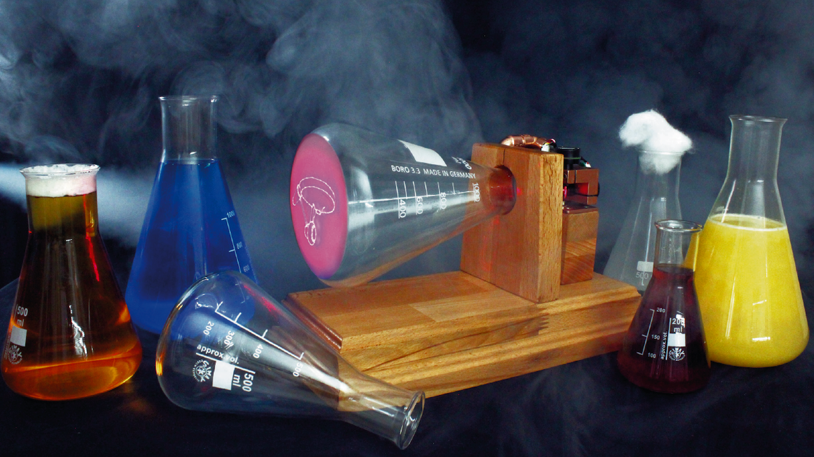

Maker Media GmbH

***

# Erlenmeyer-Laserröhre

**Nein, das ist keine antike Oszilloskop-Röhre, die hier als Vektordisplay arbeitet: Stattdessen zeichnet ein Laserpointer die Grafiken auf den mattierten Boden eines Erlenmeyerkolbens aus dem Chemielabor. Dieser selbstgebraute Bildschirm lässt sich zudem mit beliebigen eigenen Grafiken beschicken und sogar Retro-Spiele laufen darauf, wenn man die passenden Controller bastelt.**

Hier gibt es den Code für das Projekt im Ordner _[src](./src/)_ sowie den **[Schaltplan](./doc/Schaltplan.pdf)** als PDF im Ordner _[doc](./doc/)_. Ein ergänzender **[Online-Artikel](https://heise.de/-9717333)** beschreibt, wie man den Kolben mit Flüssigkeit füllen und RGB-LEDs für weitere Lichteffekte einbauen kann.

Der vollständige Artikel zum Projekt steht in der **[Make-Ausgabe 3/24 ab Seite 8](https://www.heise.de/select/make)**.